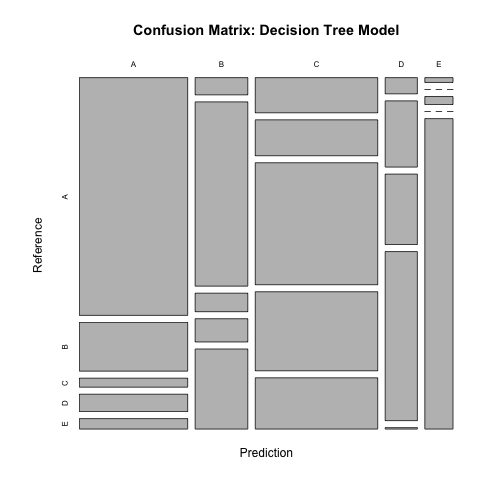

# Course Project: Practical Machine Learning

### Human Activity Recognition

---

#### Background On the Assignment *(from the course materials)*

Using devices such as Jawbone Up, Nike FuelBand, and Fitbit it is now possible to collect a large amount of data about personal activity relatively inexpensively. These type of devices are part of the quantified self movement – a group of enthusiasts who take measurements about themselves regularly to improve their health, to find patterns in their behavior, or because they are tech geeks. One thing that people regularly do is quantify how much of a particular activity they do, but they rarely quantify how well they do it. In this project, your goal will be to use data from accelerometers on the belt, forearm, arm, and dumbell of 6 participants. They were asked to perform barbell lifts correctly and incorrectly in 5 different ways. More information is available from the website [here](http://groupware.les.inf.puc-rio.br/har#weight_lifting_exercises). 

#### More on the Data Source

[Velloso, E.](http://groupware.les.inf.puc-rio.br/collaborator.jsf?p1=evelloso); Bulling, A.; Gellersen, H.; Ugulino, W.; Fuks, H. [Qualitative Activity Recognition of Weight Lifting Exercises](http://groupware.les.inf.puc-rio.br/work.jsf?p1=11201). Proceedings of 4th International Conference in Cooperation with SIGCHI (Augmented Human '13) . Stuttgart, Germany: ACM SIGCHI, 2013.


#### Synopsis

The goal was to predict the manner in which the exercise was performed. Three models were attempted. I first attempted a basic decision tree using the `rpart` method. This model had a high out-of-sample error, achieving accuracy of only 0.581 on my validation data set. I then tried a random forest model, which had accuracy of .9931. The random forest model, however, took a very long time to run, so I  tried a random forest model with PCA preprocessing, using ten principal components. This model's out-of-sample error was estimated to be .9586, so I decided to use the second model (random forest without PCA preprocessing) for my final submission.

#### Analysis

I downloaded and read the data into memory with the following code.


```r
## create a directory for the data
if (!file.exists("data")) {
        dir.create("data")
}
## download and read the data
fileUrlTrain <- "https://d396qusza40orc.cloudfront.net/predmachlearn/pml-training.csv"
fileUrlTest <- "https://d396qusza40orc.cloudfront.net/predmachlearn/pml-testing.csv"
download.file(fileUrlTrain, destfile = "./data/train.csv", method = "curl")
download.file(fileUrlTest, destfile = "./data/test.csv", method = "curl")
training <- read.csv("./data/train.csv")
testing <- read.csv("./data/test.csv")
```

I used the caret package for building my models.


```r
library(caret); library(rpart); library(randomForest);
```

##### Feature Selection

I separated the training data provided into training (`myTraining`) and validation (`myTesting`) sets. After separating the data, I decided to eliminate all columns from the training set with any missing values. I also eliminated the first eight columns, which contained descriptive data (e.g., subject name, row number, time stamps), as opposed to sensor readings. I chose to train my model with only sensor data.


```r
# separate into training and validation sets
set.seed(6547)
inTrain <- createDataPartition(y = training$classe, p = .75, list = FALSE)
myTraining <- training[inTrain,]
myTesting <- training[-inTrain,]

# eliminate features with zeroes and NA values
naCols <- sapply(myTraining, function(x) {!any(is.na(x))})
myTraining2 <- myTraining[, naCols]
zeroCols <- sapply(myTraining2, function(x) {!any(x=="")})
myTraining2 <- myTraining2[, zeroCols]
myTraining3 <- myTraining2[, -(1:8)]
```

##### Decision Tree

The first model I trained was a basic decision tree using the `rpart` method. Note that I performed the exact same column elimination on the validation data as the training data.


```r
# try to train with rpart decision tree
modFit <- train(classe ~ ., method="rpart", data=myTraining3)
# select only the relevant columns from cross-validation data set
myTesting2 <- myTesting[, naCols]
myTesting2 <- myTesting2[, zeroCols]
myTesting3 <- myTesting2[, -(1:8)]
# predict activity based on decision tree
predictions.1 <- predict(modFit, newdata=myTesting3)
# calculate confusion matrix to estimate out-of-sample error
CV.1 <- confusionMatrix(predictions.1, myTesting3$classe)
```

```r
CV.1
```

```
## Confusion Matrix and Statistics
## 
##           Reference
## Prediction    A    B    C    D    E
##          A 1136  233   43   83   50
##          B   40  428   43   54  186
##          C  190  194  659  427  277
##          D   23   94  100  240    2
##          E    6    0   10    0  386
## 
## Overall Statistics
##                                         
##                Accuracy : 0.581         
##                  95% CI : (0.567, 0.595)
##     No Information Rate : 0.284         
##     P-Value [Acc > NIR] : <2e-16        
##                                         
##                   Kappa : 0.468         
##  Mcnemar's Test P-Value : <2e-16        
## 
## Statistics by Class:
## 
##                      Class: A Class: B Class: C Class: D Class: E
## Sensitivity             0.814   0.4510    0.771   0.2985   0.4284
## Specificity             0.883   0.9183    0.731   0.9466   0.9960
## Pos Pred Value          0.735   0.5699    0.377   0.5229   0.9602
## Neg Pred Value          0.923   0.8745    0.938   0.8731   0.8856
## Prevalence              0.284   0.1935    0.174   0.1639   0.1837
## Detection Rate          0.232   0.0873    0.134   0.0489   0.0787
## Detection Prevalence    0.315   0.1531    0.356   0.0936   0.0820
## Balanced Accuracy       0.849   0.6847    0.751   0.6225   0.7122
```

```r
plot(CV.1[[2]], main="Confusion Matrix: Decision Tree Model")
```

 

Due to the realtively high out-of-sample error for the decision tree (as reflected by a relatively low accuracy of 0.581 and by the confusion matrix visualization above), I decided to try a random forest model. 


```r
# try to train with random forest NOTE- this took like an hour
modFit <- train(classe ~ ., method="rf", data=myTraining3)
predictions.2 <- predict(modFit, newdata=myTesting3)
CV.2 <- confusionMatrix(predictions.2, myTesting3$classe)
```

```r
CV.2
```

```
## Confusion Matrix and Statistics
## 
##           Reference
## Prediction    A    B    C    D    E
##          A 1393    6    0    0    0
##          B    2  942    8    0    0
##          C    0    1  845   11    1
##          D    0    0    2  793    2
##          E    0    0    0    0  898
## 
## Overall Statistics
##                                         
##                Accuracy : 0.993         
##                  95% CI : (0.991, 0.995)
##     No Information Rate : 0.284         
##     P-Value [Acc > NIR] : <2e-16        
##                                         
##                   Kappa : 0.991         
##  Mcnemar's Test P-Value : NA            
## 
## Statistics by Class:
## 
##                      Class: A Class: B Class: C Class: D Class: E
## Sensitivity             0.999    0.993    0.988    0.986    0.997
## Specificity             0.998    0.997    0.997    0.999    1.000
## Pos Pred Value          0.996    0.989    0.985    0.995    1.000
## Neg Pred Value          0.999    0.998    0.998    0.997    0.999
## Prevalence              0.284    0.194    0.174    0.164    0.184
## Detection Rate          0.284    0.192    0.172    0.162    0.183
## Detection Prevalence    0.285    0.194    0.175    0.163    0.183
## Balanced Accuracy       0.998    0.995    0.993    0.993    0.998
```

```r
plot(CV.2[[2]], main="Confusion Matrix: Random Forest Model")
```

 

This model was very accurate (accuracy of 0.993), and this is evident in the confusion matrix visualization above, but the model took a very long time to run. I decided to try preprocessing the data with PCA in order to train a simpler, faster model.


```r
## try random forest with PCA
# how many principal components do I need?
prComp <- prcomp(myTraining3[, -52])
summary(prComp)
```

```
## Importance of components:
##                            PC1     PC2     PC3     PC4      PC5     PC6
## Standard deviation     599.592 534.111 470.688 378.540 356.3452 255.490
## Proportion of Variance   0.264   0.210   0.163   0.105   0.0933   0.048
## Cumulative Proportion    0.264   0.474   0.636   0.742   0.8350   0.883
##                             PC7      PC8      PC9     PC10     PC11
## Standard deviation     193.8830 174.6067 158.2537 118.0379 97.46181
## Proportion of Variance   0.0276   0.0224   0.0184   0.0102  0.00698
## Cumulative Proportion    0.9106   0.9330   0.9514   0.9617  0.96864
##                            PC12     PC13     PC14     PC15     PC16
## Standard deviation     89.48751 76.07590 68.21269 62.13731 56.99117
## Proportion of Variance  0.00588  0.00425  0.00342  0.00284  0.00239
## Cumulative Proportion   0.97452  0.97877  0.98219  0.98503  0.98741
##                            PC17     PC18     PC19     PC20     PC21
## Standard deviation     53.11089 49.34854 48.60134 41.66484 37.38674
## Proportion of Variance  0.00207  0.00179  0.00174  0.00128  0.00103
## Cumulative Proportion   0.98949  0.99127  0.99301  0.99429  0.99531
##                            PC22    PC23     PC24     PC25    PC26     PC27
## Standard deviation     35.23054 32.9351 30.43631 25.32312 23.2979 21.46298
## Proportion of Variance  0.00091  0.0008  0.00068  0.00047  0.0004  0.00034
## Cumulative Proportion   0.99622  0.9970  0.99770  0.99817  0.9986  0.99891
##                            PC28     PC29    PC30     PC31    PC32    PC33
## Standard deviation     20.78410 17.31094 1.5e+01 13.74095 9.43594 7.66701
## Proportion of Variance  0.00032  0.00022 1.7e-04  0.00014 0.00007 0.00004
## Cumulative Proportion   0.99923  0.99945 1.0e+00  0.99975 0.99982 0.99986
##                           PC34    PC35    PC36    PC37    PC38    PC39
## Standard deviation     7.30753 6.67559 6.07513 4.63924 3.68440 3.36842
## Proportion of Variance 0.00004 0.00003 0.00003 0.00002 0.00001 0.00001
## Cumulative Proportion  0.99990 0.99993 0.99996 0.99998 0.99999 0.99999
##                        PC40 PC41 PC42  PC43  PC44  PC45  PC46 PC47  PC48
## Standard deviation     1.95 1.52 1.25 0.467 0.397 0.359 0.314 0.24 0.203
## Proportion of Variance 0.00 0.00 0.00 0.000 0.000 0.000 0.000 0.00 0.000
## Cumulative Proportion  1.00 1.00 1.00 1.000 1.000 1.000 1.000 1.00 1.000
##                         PC49  PC50   PC51
## Standard deviation     0.186 0.104 0.0365
## Proportion of Variance 0.000 0.000 0.0000
## Cumulative Proportion  1.000 1.000 1.0000
```

I arbitrarily chose ten principal components as the cutoff for my model, which appeared to cover 96% of the variance in the underlying data. I trained my third model using these ten principal components.


```r
# build a model with 10 PCs
preProc <- preProcess(myTraining3[, -52], method="pca", pcaComp=10)
trainPC <- predict(preProc, myTraining3[, -52]) ## trainPC is the principal components of the training set
##train the model based on the principal components of the training data
modFitPC <- train(myTraining3$classe ~ ., method="rf", data=trainPC) 
```


```r
# cross-validate the PC model
testPC <- predict(preProc, myTesting3[, -52])
predictions.3 <- predict(modFitPC, testPC)
CV.3 <- confusionMatrix(predictions.3, myTesting3$classe)
```

```r
CV.3
```

```
## Confusion Matrix and Statistics
## 
##           Reference
## Prediction    A    B    C    D    E
##          A 1363   30    9    8    4
##          B    7  885   12    6    5
##          C   15   18  826   41    8
##          D    6   14    6  746    5
##          E    4    2    2    3  879
## 
## Overall Statistics
##                                         
##                Accuracy : 0.958         
##                  95% CI : (0.952, 0.964)
##     No Information Rate : 0.284         
##     P-Value [Acc > NIR] : < 2e-16       
##                                         
##                   Kappa : 0.947         
##  Mcnemar's Test P-Value : 1.17e-07      
## 
## Statistics by Class:
## 
##                      Class: A Class: B Class: C Class: D Class: E
## Sensitivity             0.977    0.933    0.966    0.928    0.976
## Specificity             0.985    0.992    0.980    0.992    0.997
## Pos Pred Value          0.964    0.967    0.910    0.960    0.988
## Neg Pred Value          0.991    0.984    0.993    0.986    0.995
## Prevalence              0.284    0.194    0.174    0.164    0.184
## Detection Rate          0.278    0.180    0.168    0.152    0.179
## Detection Prevalence    0.288    0.187    0.185    0.158    0.181
## Balanced Accuracy       0.981    0.962    0.973    0.960    0.986
```

```r
plot(CV.3[[2]], main="Confusion Matrix: Random Forest Model with PCA")
```

 

This model did run more quickly, but because the estimated out-of-sample error was higher (as reflected by a slightly lower accuracy of 0.958), I decided to use the non-PCA-based model (my second model) for my final submission.

#### Conclusion

Although it took a long time to run, my random forest model was the strongest. It's estimated out-of-sample accuracy was 99% and it correctly classified all test cases when I submitted answers to the class autograder.
